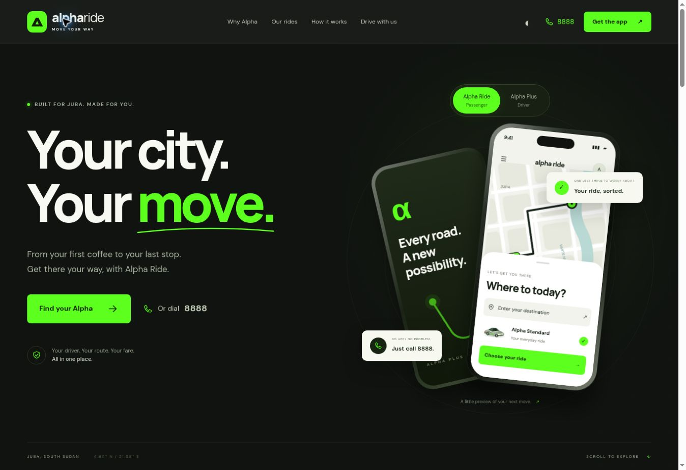

# Alpha Ride homepage

A responsive, animated one-page website for Alpha Ride and Alpha Plus in Juba. The supplied homepage informed the green branding, app calls to action and 8888 booking flow. Arada Transports informed the app-preview switching, layered phones and motion direction. All site copy, layouts, app illustrations and vehicle artwork are original to this implementation; no Arada assets or code are used.

## Run locally

No build step or dependencies are required. From this folder:

```sh
python -m http.server 8080
```

Open http://localhost:8080. Any static host can serve this repository with `index.html` as its entry point.

## Configure downloads

Edit `config.js` with the verified Google Play and App Store URLs for each app. Empty or invalid URLs show an availability dialog. Only HTTPS URLs on `play.google.com` and `apps.apple.com` are accepted. The call buttons use `tel:8888`, as provided in the design brief.

The illustrated phone screens are marketing previews, not live ride data. Ride options and availability must be confirmed in the app. Vehicle illustrations and the lettermark live under `assets/`; replace them with approved brand assets or app screenshots if desired.

## Included

- Passenger/driver app preview toggle
- Animated map route, floating phones, pointer-reactive background and scrolling ribbon
- Standard, Boda and Rickshaw tabs with keyboard navigation
- Light/dark theme with local preference storage
- Mobile navigation, native FAQ disclosures and accessible download dialog
- Reduced-motion support, visible focus states and script-free content fallback

Google Fonts are optional external requests; system fonts provide fallbacks. All other assets are local, and there are no analytics, API keys or backend dependencies.

## Preview and validation



Desktop browser checks verified the rendered hero, ride artwork, passenger/driver switching, arrow-key ride-tab navigation, theme switching, and download-availability dialog. HTML identifiers, anchor targets, ARIA references, local assets, SVG XML, and JavaScript syntax were checked. The responsive layouts and reduced-motion rules are implemented; phone-size visual checks remain to be completed on a device or a viewport-enabled browser.
