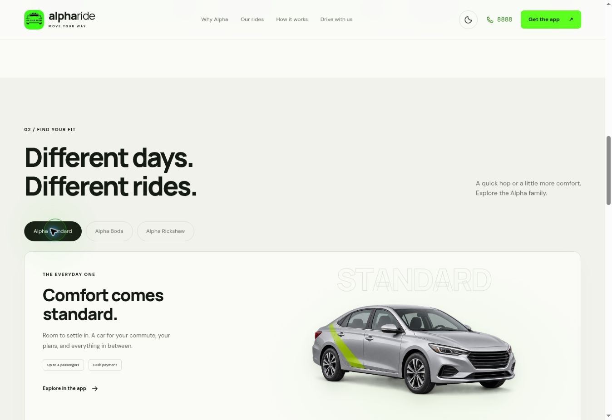

# Alpha Ride homepage

A responsive, animated one-page website for Alpha Ride and Alpha Plus in Juba. The supplied homepage informed the green branding, app calls to action and 8888 booking flow. Arada Transports informed the app-preview switching, layered phones and motion direction. No Arada assets or code are used. The app logo is supplied by the owner; the car render is generated for this project.

## Run locally

No build step or dependencies are required. From this folder:

```sh
python -m http.server 8080
```

Open http://localhost:8080. Any static host can serve this repository with `index.html` as its entry point.

## Configure downloads

Edit `config.js` with the verified Google Play and App Store URLs for each app. Empty or invalid URLs show an availability dialog. Only HTTPS URLs on `play.google.com` and `apps.apple.com` are accepted. The call buttons use `tel:8888`, as provided in the design brief.

The illustrated phone screens are marketing previews, not live ride data. Ride options and availability must be confirmed in the app. The supplied app logo is embedded and framed in `assets/logo.svg`. The realistic sedan is `assets/car-real.png`; Boda and Rickshaw illustrations also live under `assets/`.

## Included

- Passenger/driver app preview toggle
- Animated map route, floating phones, pointer-reactive background and scrolling ribbon
- Standard, Boda and Rickshaw tabs with keyboard navigation
- Light/dark theme with local preference storage
- Mobile navigation, native FAQ disclosures and accessible download dialog
- Reduced-motion support, visible focus states and script-free content fallback

Google Fonts are optional external requests; system fonts provide fallbacks. All other assets are local, and there are no analytics, API keys or backend dependencies.

## Preview and validation


Desktop browser checks verified the rendered hero, ride artwork, passenger/driver switching, arrow-key ride-tab navigation, theme switching, and download-availability dialog. HTML identifiers, anchor targets, ARIA references, local assets, SVG XML, and JavaScript syntax were checked. The responsive layouts and reduced-motion rules are implemented; phone-size visual checks remain to be completed on a device or a viewport-enabled browser.

## Visual refresh

Light is the default on a first visit. A moon button switches to dark; a sun button switches back. The chosen theme is remembered. The header, hero, driver section and footer follow the theme. Mouse users get a soft cursor trail, pointer-position card highlights and phone parallax. Touch and reduced-motion users do not receive these pointer effects.



Verified in the desktop browser: both theme icons and surfaces, logo and car loading, Standard/Boda switching, cursor activation, and no horizontal overflow. JavaScript syntax, unique HTML IDs and local asset references pass. Phone-size visual checks remain outstanding.

Car generation used the built-in imagegen tool. Final asset: `assets/car-real.png`. Prompt: “Use case: product-mockup. Website ride-selector asset: a photorealistic elegant silver compact four-door sedan, front three-quarter view, front facing right. Full vehicle including all wheels and mirrors comfortably inside a wide frame, centered with minimal padding. Correct realistic geometry, crisp premium automotive studio photography, soft neutral studio lighting, subtle lime green accent on the side door, no brand badge, no text, no watermark, no scene or ground plane. Genuine transparent background with a subtle soft contact shadow only. Should look like a real everyday passenger taxi car, not a cartoon, not low-poly, not futuristic.”
